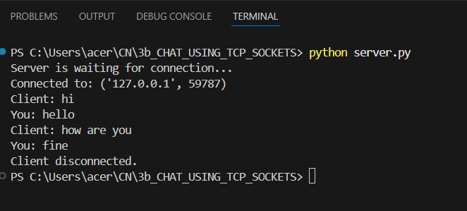

# 3b.CREATION FOR CHAT USING TCP SOCKETS
## AIM
To write a python program for creating Chat using TCP Sockets Links.
## ALGORITHM:
1. Import the necessary modules in python
2. Create a socket connection to using the socket module.
3. Send message to the client and receive the message from the client using the Socket module in
 server
4. Send and receive the message using the send function in socket.
## PROGRAM
# server 
```import socket
server = socket.socket(socket.AF_INET, socket.SOCK_STREAM)
host = "127.0.0.1" 
port = 5000
server.bind((host, port))
server.listen(1)
print("Server is waiting for connection...")
conn, addr = server.accept()
print("Connected to:", addr)
while True:
    message = conn.recv(1024).decode()
    if message.lower() == "exit":
        print("Client disconnected.")
        break
    print("Client:", message)
    reply = input("You: ")
    conn.send(reply.encode())
    if reply.lower() == "exit":
        break
conn.close()
server.close()
```
# client
```
import socket
client = socket.socket(socket.AF_INET, socket.SOCK_STREAM)
host = "127.0.0.1"  
port = 5000
client.connect((host, port))
print("Connected to server.")
while True:
    message = input("You: ")
    client.send(message.encode())
    if message.lower() == "exit":
        break
    reply = client.recv(1024).decode() 
    if reply.lower() == "exit":
        print("Server disconnected.")
        break
    print("Server:", reply)
client.close()
```
## OUPUT
# server

# client 


## RESULT
Thus, the python program for creating Chat using TCP Sockets Links was successfully 
created and executed.
